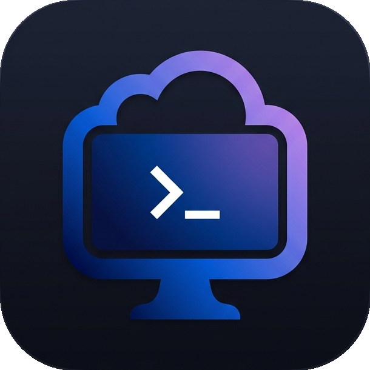

[English](/README.md) | [中文](/README_zh-CN.md)

<h1 align="center">
  
   VPS Studio 
</h1>

  <strong>A modern, high-performance, fully local cross-platform server management & SSH client.</strong>

 

  
  
  
  

 

## 📢 What's New

*This is the initial `v0.2.0` release. There are no historical updates yet. Future release notes, bug fixes, and new features will be documented here.*

 

## 🚀 Why VPS Studio? (Core Features)

Traditional SSH clients (like Xshell, Putty) often feature outdated UI, while modern alternatives (like Termius) rely heavily on cloud synchronization, which always poses security concerns for privacy-focused geeks and developers.

**VPS Studio** was born to solve this. It aims to provide an **ultimately modern user experience** while ensuring that **you completely own your data**:

- 🔒 **Fully Local Data Storage**: No account registration needed, no reliance on cloud services. All your server configurations, SSH keys, and passwords are securely persisted locally on your computer's hard drive via WebView2, guaranteeing true privacy and security.
- ⚡ **Extremely Lightweight & High-Performance**: Built with **Rust** and Tauri on the backend, it consumes very little memory and launches buttery smooth.
- 🔑 **Powerful Keychain & Identity Management**: Features a robust local keychain supporting one-click generation of modern `Ed25519`, `RSA`, or `ECDSA` keys. Easily bind an "Identity" (credentials + username) and assign it to multiple hosts, keeping dozens of servers perfectly organized.
- 💡 **One-Click Snippets**: Features a built-in Snippets library. Send complex commands in batches to your target server with just one click, saying goodbye to repetitive typing.
- 🇨🇳 **Native Immersive Localization**: Deeply customized for local developers with full interface translations, eliminating language barriers.
- 💻 **Integrated Local Terminal**: No need to switch apps. Bring up the local PowerShell right from the main interface with a single click to manage your local environment effortlessly.

## 📦 Installation

VPS Studio offers highly flexible ways to use the app to meet different user preferences. You can find the following two versions in the Releases page:

### 1. Portable Version
Download `VPS-Studio-version-Portable.zip`.
**How to use**: Just extract its content and double-click to run! Completely green and installation-free. No environment setup needed—you can place it on your desktop or carry it on a USB drive. It runs instantly on any modern Windows 10/11 machine (with Microsoft Edge WebView2 built-in).

### 2. Standard Installer
Download `VPS-Studio-version-Setup.exe`.
**How to use**: Double-click to run the setup wizard. It will automatically register in the Windows Control Panel and create desktop shortcuts. To uninstall, simply use the Control Panel or run the included uninstaller (`unins000.exe`) for a completely clean removal.

## 📖 Quick Start Guide

1. **Manage Your Credentials**: Click the sidebar to enter the **Keychain**. You can directly generate a new `Ed25519` key or import your existing private key file via drag-and-drop.
2. **Define an Identity**: Bind your key or password from the keychain with a login username (e.g., `root`) to create an "Identity".
3. **Add a Host**: Click "New" on the Hosts list page, enter your server IP, and select the newly created "Identity" directly from the dropdown menu.
4. **One-Click Connect**: Double-click the server card you just added (or right-click and choose Connect) to instantly bring up the terminal and enter management mode!

## 👨‍💻 Tech Stack

- **Frontend**: HTML5, Vanilla JavaScript, CSS3
- **Backend / Core**: Rust, Tauri
- **Terminal Emulator**: xterm.js (Integrated)
- **Installer Engine**: Inno Setup

---

  <b>Copyright &copy; 2026 Caesars Network LLC. All rights reserved.</b>

